# 基于Pygame的2D西游记RPG小游戏

## 概要设计文档

**【课程名称】：** 软件项目开发与实践

**【项目名称】：** 基于Pygame的2D西游记RPG小游戏

**【文档版本】：** V1.0

**【编写日期】：** 2026年6月24日

**【编写人员】：** 本人

---

## 一、引言

### 1.1 编写目的

本文档是《基于Pygame的2D西游记RPG小游戏》的概要设计文档，旨在描述系统的总体架构、模块划分、接口设计、数据结构和算法设计，为详细设计和编码实现提供指导。

本文档适用于以下读者：

- 开发人员：理解系统架构和模块职责
- 测试人员：了解系统结构以设计测试用例
- 课程教师：了解项目的设计方案

### 1.2 项目背景

本项目为软件项目开发课程实训项目，以 Pygame 为开发框架，实现一款以西游记"祸起观音院"为故事背景的 2D RPG 游戏。玩家扮演孙悟空，需要在村庄中与NPC交互获取线索和属性加成，最终前往寺庙挑战牛怪。

### 1.3 术语与缩写

| 术语/缩写 | 说明 |
|-----------|------|
| RPG | Role-Playing Game，角色扮演游戏 |
| TMX | Tiled Map XML，Tiled地图编辑器格式 |
| HP | Hit Points，生命值/血量 |
| ATK | Attack，攻击力 |
| WASD | 游戏操控键位（上左下右） |
| HUD | Heads-Up Display，平视显示器（游戏界面信息） |
| FPS | Frames Per Second，每秒帧数 |
| Pygame | Python游戏开发库 |
| pytmx | Python TMX地图解析库 |
| OOP | 面向对象编程 |
| AI | Artificial Intelligence，人工智能 |

### 1.4 参考资料

- Pygame官方文档：https://www.pygame.org/docs/
- pytmx库文档：https://pytmx.readthedocs.io/
- Tiled Map Editor：https://www.mapeditor.org/
- 需求规格说明文档

## 二、系统总体设计

### 2.1 系统架构设计

系统采用分层模块化设计，分为核心层、角色层、系统层、场景层和工具层，共5层架构。

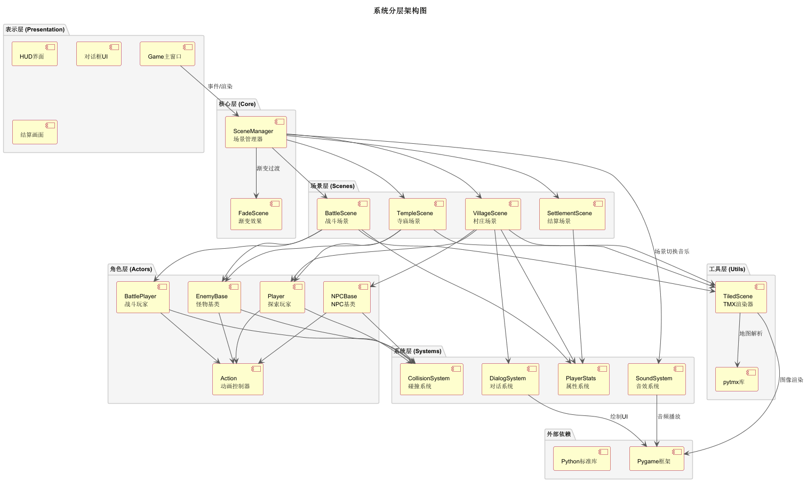

各层职责说明：

| 层级 | 模块 | 职责 |
|------|------|------|
| 核心层 | Game, SceneManager | 游戏初始化、主循环、场景调度、渐变过渡 |
| 角色层 | Player, NPC, Enemy | 角色行为、动画控制、碰撞检测、AI逻辑 |
| 系统层 | Dialog, Stats, Sound, Collision | 对话显示、属性管理、音效播放、碰撞检测 |
| 场景层 | Village, Temple, Battle, Settlement | 场景逻辑、事件处理、画面渲染 |
| 工具层 | TiledScene, FadeScene | TMX地图加载渲染、渐变效果实现 |

### 2.2 模块划分与职责

系统共分为以下主要模块：

1. **核心模块**：Game主类、SceneManager场景管理器
2. **角色模块**：ActorBase基类、Player、BattlePlayer、NPCBase、EnemyBase
3. **系统模块**：DialogSystem、PlayerStats、SoundSystem、CollisionSystem
4. **场景模块**：VillageScene、TempleScene、BattleScene、SettlementScene
5. **工具模块**：TiledScene、FadeScene

### 2.3 技术选型与依据

| 技术 | 版本 | 选型依据 |
|------|------|---------|
| Python | 3.0+ | 课程要求，语法简洁，生态丰富 |
| Pygame | 2.0+ | 成熟的2D游戏开发框架，支持精灵、碰撞、音效 |
| pytmx | 3.0+ | 支持Tiled地图编辑器格式，便于地图设计 |
| Tiled | 最新版 | 可视化地图编辑器，支持对象层定义出生点 |

## 三、接口设计

### 3.1 用户接口设计

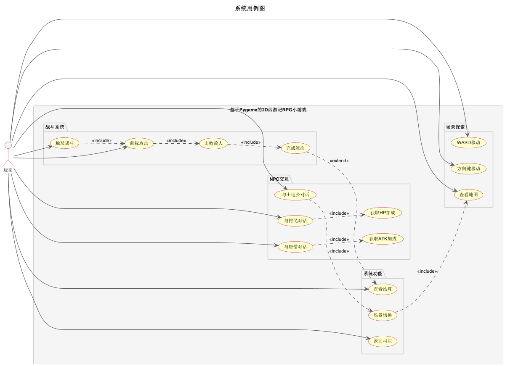

用户界面元素说明：

| 界面元素 | 位置 | 说明 |
|---------|------|------|
| 游戏窗口 | 屏幕中央 | 800×600像素，标题"基于Pygame的2D西游记RPG小游戏" |
| HUD | 屏幕下方 | 血条、攻击力、波次信息（战斗中） |
| 对话框 | 屏幕底部 | 半透明黑色背景，双行文字 |
| 提示信息 | 角色头顶 | "按空格键发起对话/战斗" |
| 结算画面 | 屏幕中央 | 战斗结果、属性信息 |

### 3.2 内部接口设计

模块间调用关系：

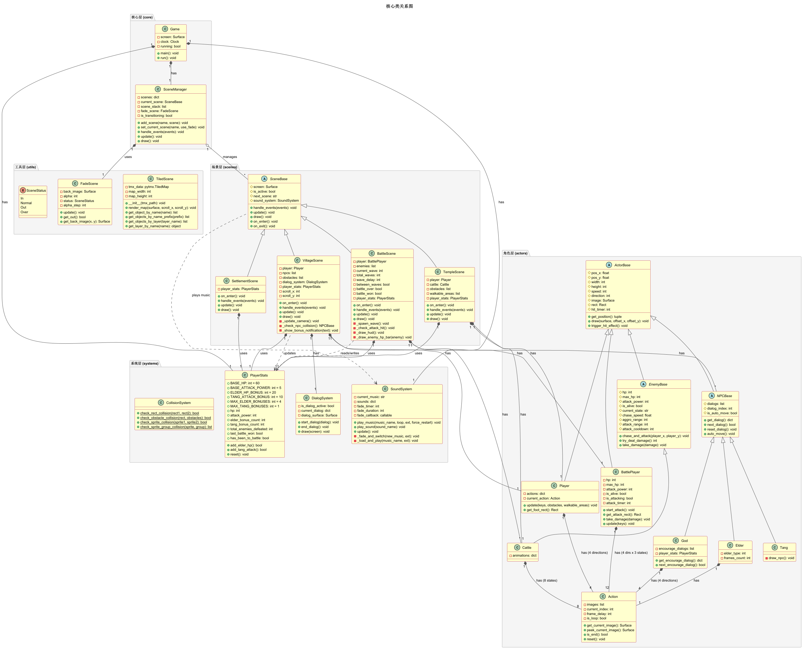

核心接口说明：

| 接口名称 | 所属模块 | 功能说明 |
|---------|---------|---------|
| set_current_scene() | SceneManager | 切换当前场景，支持渐变过渡 |
| handle_events() | SceneBase | 处理用户输入事件 |
| update() | SceneBase | 更新场景状态 |
| draw() | SceneBase | 渲染场景画面 |
| on_enter() | SceneBase | 场景进入时初始化 |
| on_exit() | SceneBase | 场景退出时清理 |
| start_attack() | BattlePlayer | 开始攻击动画 |
| get_attack_rect() | BattlePlayer | 获取攻击范围 |
| take_damage() | ActorBase | 接受伤害处理 |
| chase_and_attack() | EnemyBase | 敌人追击AI逻辑 |
| play_music() | SoundSystem | 播放背景音乐，支持渐弱切换 |
| add_elder_hp() | PlayerStats | 增加血量属性 |
| add_tang_attack() | PlayerStats | 增加攻击力属性 |

## 四、数据结构设计

### 4.1 核心数据类设计

#### 4.1.1 PlayerStats 属性系统

PlayerStats 是玩家属性的持久化存储类，采用单例模式，通过引用传递给所有场景。

```python
class PlayerStats:
    # 可调节的配置值
    BASE_HP = 60              # 初始血量
    BASE_ATTACK_POWER = 5     # 初始攻击力
    ELDER_HP_BONUS = 20       # 每次与村民交互增加血量
    TANG_ATTACK_BONUS = 10    # 每次与唐僧交互增加攻击力
    MAX_ELDER_BONUSES = 4     # 最多4个村民
    MAX_TANG_BONUSES = 1      # 1个唐僧

    def __init__(self):
        self.hp = self.BASE_HP
        self.attack_power = self.BASE_ATTACK_POWER
        self.elder_bonus_count = 0
        self.tang_bonus_count = 0
        self.total_enemies_defeated = 0
        self.last_battle_won = False
        self.has_been_to_battle = False
```

#### 4.1.2 ActorBase 角色基类

```python
class ActorBase(pygame.sprite.Sprite):
    DOWN = 0
    LEFT = 1
    UP = 2
    RIGHT = 3

    def __init__(self, x, y, width, height, speed):
        self.pos_x = x
        self.pos_y = y
        self.width = width
        self.height = height
        self.speed = speed
        self.direction = self.DOWN
        self.image = None
        self.rect = None
        self.hit_timer = 0
        self.hit_duration = 10
        self.original_image = None
```

#### 4.1.3 BattlePlayer 战斗玩家

```python
class BattlePlayer(ActorBase):
    def __init__(self, x, y):
        super().__init__(x, y, 90, 126, 4)
        self.hp = 60
        self.max_hp = 60
        self.attack_power = 5
        self.is_alive = True
        self.is_attacking = False
        self.attack_timer = 0
        self.attack_duration = 20
```

#### 4.1.4 EnemyBase 敌人基类

```python
class EnemyBase(ActorBase):
    def __init__(self, x, y, width, height, hp, attack_power):
        super().__init__(x, y, width, height, 1.5)
        self.hp = hp
        self.max_hp = hp
        self.attack_power = attack_power
        self.is_alive = True
        self.current_state = 'station'
        self.aggro_range = 300
        self.attack_range = 40
        self.attack_cooldown = 60
```

### 4.2 数据持久化设计

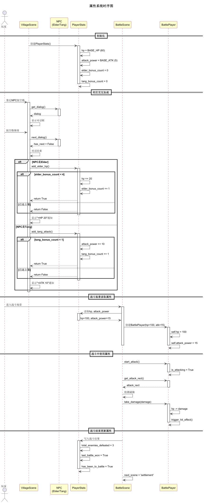

数据持久化采用内存引用传递方式：

1. **创建阶段**：Game主类创建PlayerStats单例
2. **传递阶段**：通过构造函数传递给各场景
3. **更新阶段**：VillageScene更新属性（NPC交互加成）
4. **读取阶段**：BattleScene读取属性（创建BattlePlayer）
5. **回写阶段**：BattleScene写回战斗结果

### 4.3 资源文件结构

| 类型 | 路径 | 说明 |
|------|------|------|
| 玩家精灵(探索) | resource/img/swk2/ | 孙悟空128帧PNG |
| 玩家精灵(战斗) | resource/img/swk/ | 孙悟空16帧TGA |
| NPC精灵 | resource/img/elder/ | 村民TGA格式 |
| 怪物精灵 | resource/img/cattle/ | 牛怪TGA格式 |
| 土地公 | resource/img/god/ | 土地公4方向40帧 |
| 地图文件 | resource/tmx/village1.tmx | 村庄地图 |
| 地图文件 | resource/tmx/temple.tmx | 寺庙地图 |
| 地图文件 | resource/tmx/test.tmx | 战斗地图（暂时） |
| 字体文件 | resource/font/newfont.TTF | 中文字体 |
| 背景音乐 | resource/sound/bgm.mp3 | 村庄/寺庙音乐 |
| 战斗音乐 | resource/sound/fight.mp3 | 战斗音乐 |

## 五、模块详细设计

### 5.1 核心层模块

#### 5.1.1 Game主类

Game类是游戏入口，负责初始化Pygame、创建显示窗口、启动游戏主循环。

```python
def main():
    pygame.init()
    screen = pygame.display.set_mode((800, 600))
    clock = pygame.time.Clock()

    sound_system = SoundSystem()
    player_stats = PlayerStats()
    scene_manager = SceneManager(screen, sound_system)

    # 注册场景
    scene_manager.add_scene('village', VillageScene(screen, player_stats))
    scene_manager.add_scene('temple', TempleScene(screen, player_stats))
    scene_manager.add_scene('battle', BattleScene(screen, player_stats))
    scene_manager.add_scene('settlement', SettlementScene(screen, player_stats))

    scene_manager.set_current_scene('village', use_fade=False)

    while running:
        events = pygame.event.get()
        scene_manager.handle_events(events)
        scene_manager.update()
        scene_manager.draw()
        sound_system.update()

        if current_scene.next_scene:
            scene_manager.set_current_scene(next_scene)

        pygame.display.flip()
        clock.tick(40)
```

#### 5.1.2 SceneManager 场景管理器

SceneManager 负责场景的注册、切换和渐变过渡。

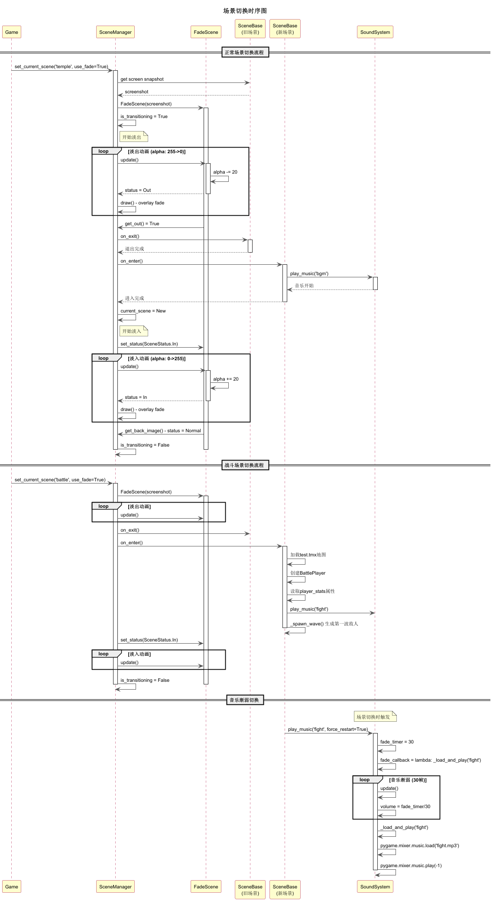

核心算法：

```python
def set_current_scene(name, use_fade=True):
    if use_fade and self.current_scene:
        # 截图当前屏幕
        screenshot = self.screen.copy()
        # 创建渐变场景
        self.fade_scene = FadeScene(screenshot)
        self.is_transitioning = True
        self.next_scene_name = name
    else:
        # 直接切换
        if self.current_scene:
            self.current_scene.on_exit()
        self.current_scene = self.scenes[name]
        self.current_scene.on_enter()

def update(self):
    if self.is_transitioning:
        self.fade_scene.update()
        if self.fade_scene.get_out():  # 淡出完成
            # 切换到新场景
            self.current_scene.on_exit()
            self.current_scene = self.scenes[self.next_scene_name]
            self.current_scene.on_enter()
            self.fade_scene.set_status(SceneStatus.In)
        if self.fade_scene.get_status() == SceneStatus.Normal:
            self.is_transitioning = False
```

### 5.2 角色层模块

#### 5.2.1 Player 探索玩家

玩家在村庄和寺庙场景中使用，支持WASD/方向键移动，具备碰撞检测。

```python
def update(self, keys, obstacles, walkable_areas):
    if self.is_talking:
        return  # 对话时禁止移动

    dx, dy = 0, 0
    speed = self.speed // 2 if keys[pygame.K_LSHIFT] else self.speed

    # 方向键设置方向（用于动画）
    if keys[pygame.K_DOWN]: self.direction = self.DOWN
    elif keys[pygame.K_LEFT]: self.direction = self.LEFT
    elif keys[pygame.K_UP]: self.direction = self.UP
    elif keys[pygame.K_RIGHT]: self.direction = self.RIGHT

    # 累积移动量（支持斜向移动）
    if keys[pygame.K_DOWN] or keys[pygame.K_s]: dy += speed
    if keys[pygame.K_LEFT] or keys[pygame.K_a]: dx -= speed
    if keys[pygame.K_UP] or keys[pygame.K_w]: dy -= speed
    if keys[pygame.K_RIGHT] or keys[pygame.K_d]: dx += speed

    # 斜向移动归一化
    if dx != 0 and dy != 0:
        dx *= 0.707
        dy *= 0.707

    # 碰撞检测
    foot_rect = self.get_foot_rect()
    test_rect = foot_rect.move(dx, dy)

    # 检查障碍物碰撞
    for obstacle in obstacles:
        if test_rect.colliderect(obstacle):
            dx, dy = 0, 0
            break

    # 更新位置
    self.pos_x += dx
    self.pos_y += dy
```

#### 5.2.2 BattlePlayer 战斗玩家

战斗玩家在战斗场景中使用，增加攻击状态和伤害处理。

```python
def get_attack_rect(self):
    center_x = self.pos_x + self.width // 2
    center_y = self.pos_y + self.height // 2

    if self.direction == self.DOWN:
        return pygame.Rect(center_x - 40, center_y, 80, 60)
    elif self.direction == self.UP:
        return pygame.Rect(center_x - 40, center_y - 60, 80, 60)
    elif self.direction == self.LEFT:
        return pygame.Rect(center_x - 60, center_y - 20, 60, 40)
    elif self.direction == self.RIGHT:
        return pygame.Rect(center_x, center_y - 20, 60, 40)
```

#### 5.2.3 EnemyBase 敌人AI

敌人AI采用状态机模式，包含站立、追击、攻击三种状态。

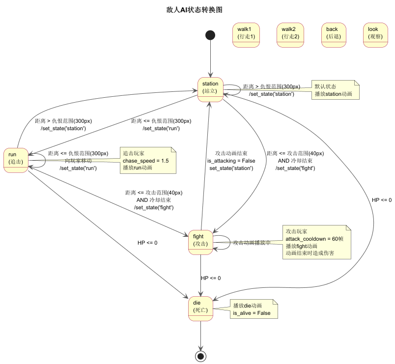

```python
def chase_and_attack(self, player_x, player_y):
    if not self.is_alive:
        return

    # 计算与玩家的距离
    dx = player_x - self.pos_x
    dy = player_y - self.pos_y
    distance = (dx**2 + dy**2) ** 0.5

    # 攻击冷却计时
    if self.attack_cooldown_timer > 0:
        self.attack_cooldown_timer -= 1

    # 攻击状态
    if self.is_attacking:
        return

    # 攻击范围内且冷却结束
    if distance <= self.attack_range and self.attack_cooldown_timer <= 0:
        self.is_attacking = True
        self.set_state('fight')
        self.attack_cooldown_timer = self.attack_cooldown
        return

    # 仇恨范围内追击
    if distance <= self.aggro_range:
        self.set_state('run')
        # 归一化移动方向
        if distance > 0:
            dx = dx / distance * self.chase_speed
            dy = dy / distance * self.chase_speed
        self.pos_x += dx
        self.pos_y += dy
    else:
        self.set_state('station')
```

### 5.3 系统层模块

#### 5.3.1 SoundSystem 音效系统

音效系统提供BGM播放和渐弱切换功能。

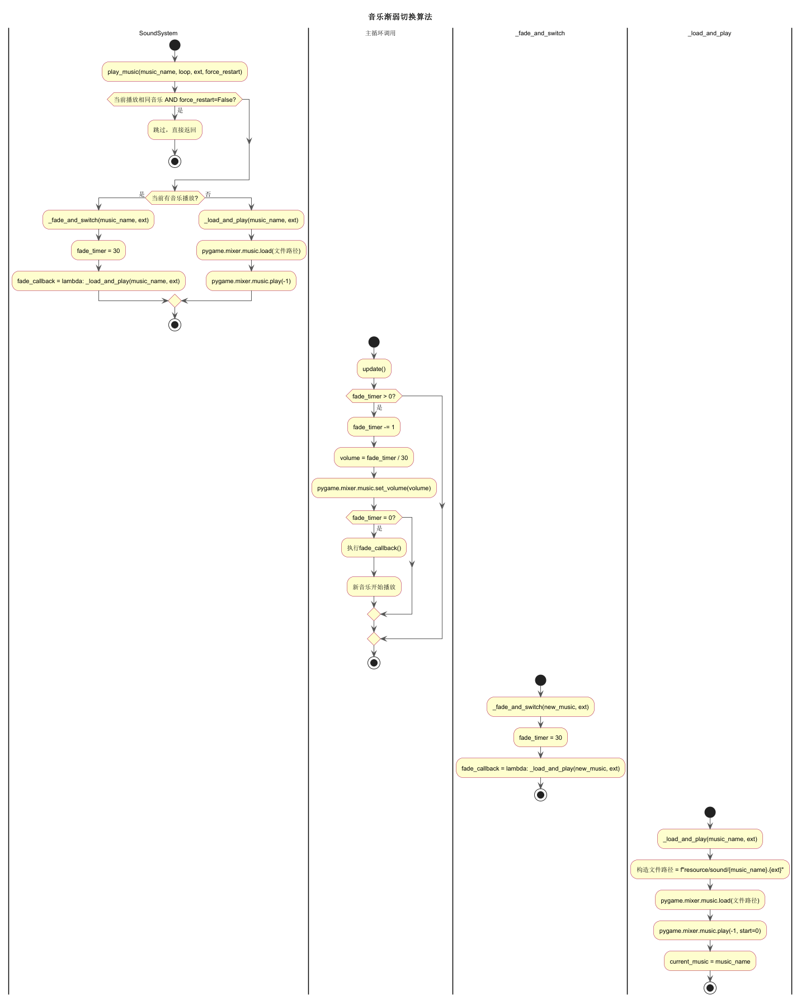

```python
def play_music(self, music_name, loop=True, ext='mp3', force_restart=False):
    # 检查是否需要切换
    if music_name == self.current_music and not force_restart:
        return

    if self.current_music:
        # 渐弱切换
        self.fade_timer = self.fade_duration
        self.fade_callback = lambda: self._load_and_play(music_name, ext)
    else:
        # 直接播放
        self._load_and_play(music_name, ext)

def update(self):
    if self.fade_timer > 0:
        self.fade_timer -= 1
        # 线性插值音量
        volume = self.fade_timer / self.fade_duration
        pygame.mixer.music.set_volume(volume)

        if self.fade_timer == 0:
            # 执行切换回调
            self.fade_callback()
```

#### 5.3.2 DialogSystem 对话系统

```python
def start_dialog(self, dialog):
    self.is_dialog_active = True
    self.current_dialog = dialog
    # 创建半透明对话框
    self.dialog_surface = pygame.Surface(
        (SCREEN_WIDTH - 100, 120), pygame.SRCALPHA
    )
    self.dialog_surface.fill((0, 0, 0, 200))

def draw(self, screen):
    if not self.is_dialog_active:
        return
    # 绘制对话框背景
    screen.blit(self.dialog_surface, (50, SCREEN_HEIGHT - 150))
    # 绘制说话者和内容
    text = f"{self.current_dialog['speaker']}：{self.current_dialog['text']}"
    # 绘制操作提示
    hint = "按空格键继续 · 按Esc键退出"
```

### 5.4 场景层模块

#### 5.4.1 VillageScene 村庄场景

村庄场景是游戏的中心枢纽，玩家在此与NPC交互获取属性加成。

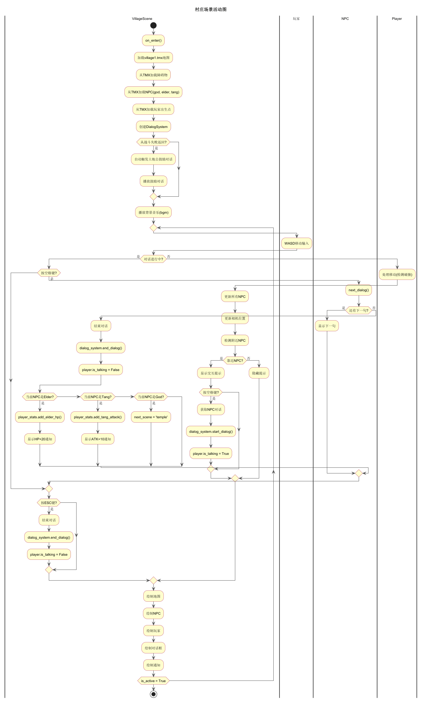

核心流程：

1. 加载village1.tmx地图和障碍物
2. 从TMX对象层加载NPC位置
3. 玩家WASD移动，检测碰撞
4. 靠近NPC按空格触发对话
5. 对话结束后给予属性加成
6. 与土地公对话后切换到寺庙场景

#### 5.4.2 BattleScene 战斗场景

战斗场景实现完整的实时战斗系统，包括波次系统和HUD显示。

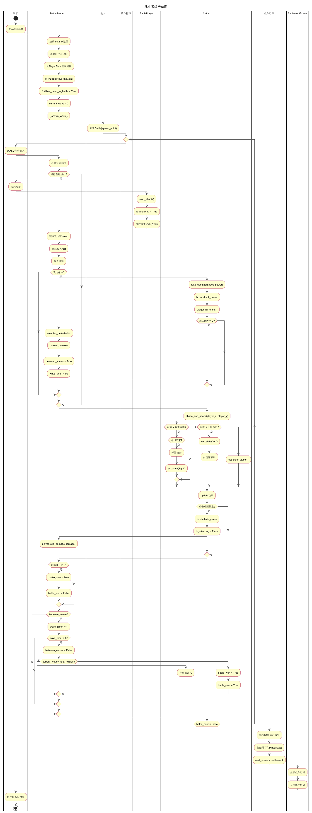

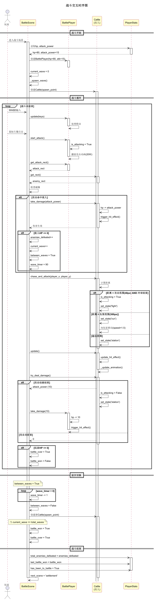

核心算法：

```python
def update(self):
    if self.battle_over:
        return

    # 更新玩家
    self.player.update(pygame.key.get_pressed())

    # 更新敌人AI
    for enemy in self.enemies:
        if enemy.is_alive:
            enemy.chase_and_attack(
                self.player.pos_x, self.player.pos_y
            )
            enemy.update()
            damage = enemy.try_deal_damage()
            if damage > 0:
                self.player.take_damage(damage)

    # 检测玩家攻击
    # (在handle_events中处理鼠标点击)

    # 波次切换
    if self.between_waves:
        self.wave_timer -= 1
        if self.wave_timer <= 0:
            self.between_waves = False
            if self.current_wave < self.total_waves:
                self._spawn_wave()
            else:
                self.battle_won = True
                self.battle_over = True

    # 检查玩家死亡
    if not self.player.is_alive:
        self.battle_won = False
        self.battle_over = True
```

### 5.5 工具层模块

#### 5.5.1 TiledScene TMX地图渲染器

```python
class TiledScene:
    def __init__(self, tmx_path):
        self.tmx_data = pytmx.util_pygame.load_pygame(tmx_path)
        self.map_width = self.tmx_data.width * self.tmx_data.tilewidth
        self.map_height = self.tmx_data.height * self.tmx_data.tileheight

    def render_map(self, surface, scroll_x, scroll_y):
        for layer in self.tmx_data.visible_layers:
            if isinstance(layer, pytmx.TiledTileLayer):
                for x, y, image in layer.tiles():
                    surface.blit(
                        image,
                        (x * self.tmx_data.tilewidth - scroll_x,
                         y * self.tmx_data.tileheight - scroll_y)
                    )
            elif isinstance(layer, pytmx.TiledImageLayer):
                surface.blit(layer.image, (0, 0))
```

#### 5.5.2 FadeScene 渐变效果

```python
class FadeScene:
    alpha_step = 20

    def __init__(self, back_image):
        self.back_image = back_image
        self.alpha = 255
        self.status = SceneStatus.Out

    def update(self):
        if self.status == SceneStatus.Out:
            self.alpha -= self.alpha_step
            if self.alpha <= 0:
                self.alpha = 0
                self.status = SceneStatus.Over
        elif self.status == SceneStatus.In:
            self.alpha += self.alpha_step
            if self.alpha >= 255:
                self.alpha = 255
                self.status = SceneStatus.Normal

    def get_back_image(self, x, y):
        image = self.back_image.copy()
        image.set_alpha(self.alpha)
        return image
```

## 六、算法设计

### 6.1 碰撞检测算法

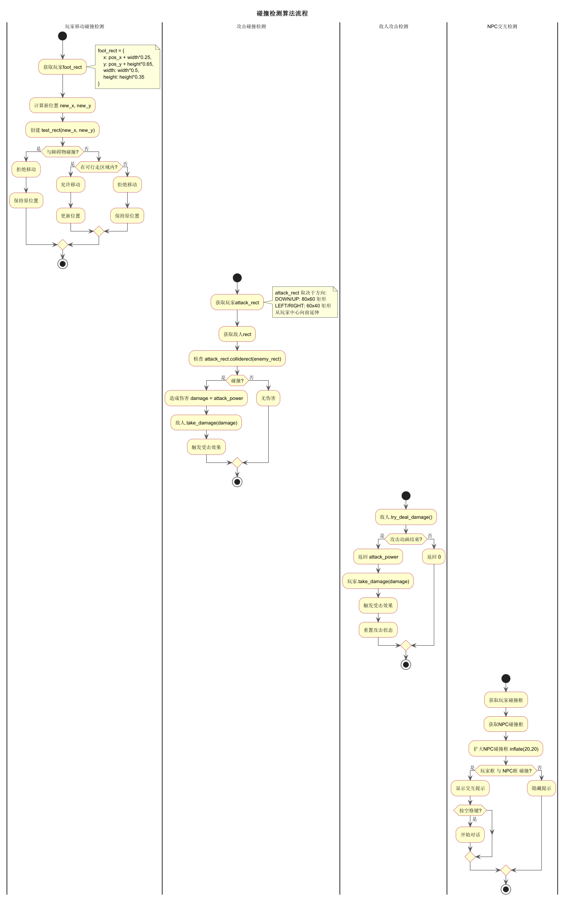

碰撞检测采用矩形碰撞（AABB）方式：

| 检测类型 | 碰撞框 | 说明 |
|---------|--------|------|
| 玩家-障碍物 | foot_rect | 脚部区域（50%宽×35%高） |
| 玩家-NPC | inflate(20,20) | 扩大检测范围 |
| 玩家-怪物 | inflate(40,40) | 扩大检测范围 |
| 攻击-敌人 | attack_rect | 方向相关的挥砍范围 |
| 敌人-玩家 | attack_rect | 敌人攻击范围 |

### 6.2 波次切换算法

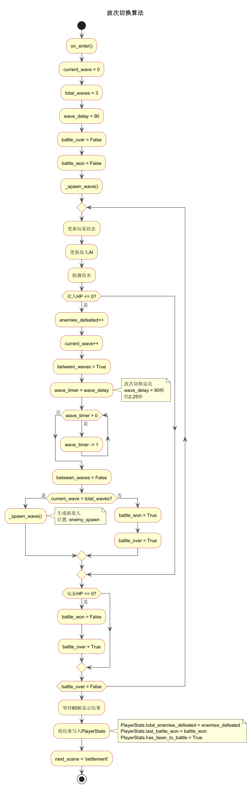

波次系统设计：

- 总波次数：TOTAL_WAVES = 3
- 波次间隔：WAVE_DELAY = 90帧（约2.25秒）
- 每波生成1个Cattle敌人
- 击败当前波敌人后开始下一波计时
- 全部击败即为战斗胜利

## 七、运行环境与部署

### 7.1 运行环境要求

| 项目 | 要求 |
|------|------|
| 操作系统 | Windows 10/11 |
| Python版本 | Python 3.0及以上 |
| Pygame版本 | Pygame 2.0及以上 |
| pytmx版本 | pytmx 3.0及以上 |
| 分辨率 | 800×600像素 |
| 帧率 | 40 FPS |

### 7.2 依赖库说明

| 库名称 | 版本 | 用途 |
|--------|------|------|
| pygame | 2.0+ | 游戏开发框架，提供窗口、事件、渲染、音频 |
| pytmx | 3.0+ | TMX地图文件解析和渲染 |
| python | 3.0+ | 编程语言 |

### 7.3 项目部署说明

1. 安装Python 3.0及以上版本
2. 安装依赖库：`pip install pygame pytmx`
3. 确保resource目录下的资源文件完整
4. 运行主程序：`python main.py`

## 附录

### 项目结构

```
journey_to_the_west/
├── main.py              # 游戏入口
├── config.py            # 全局配置
├── core/
│   └── scene_manager.py # 场景管理器
├── actors/
│   ├── action.py        # 动画行为类
│   ├── base_actor.py    # 角色基类
│   ├── player.py        # 探索玩家
│   ├── battle_player.py # 战斗玩家
│   ├── npc.py           # NPC基类
│   ├── elder.py         # 村民
│   ├── god.py           # 土地公
│   ├── tang.py          # 唐僧
│   └── enemy.py         # 敌人基类+牛怪
├── systems/
│   ├── dialog.py        # 对话系统
│   ├── player_stats.py  # 属性系统
│   ├── sound.py         # 音效系统
│   └── collision.py     # 碰撞系统
├── scenes/
│   ├── base_scene.py    # 场景基类
│   ├── village.py       # 村庄场景
│   ├── temple.py        # 寺庙场景
│   ├── battle_scene.py  # 战斗场景
│   ├── settlement_scene.py # 结算场景
│   └── end_scene.py     # 结束场景
├── utils/
│   ├── tiled_render.py  # TMX渲染器
│   └── fade_scene.py    # 渐变效果
└── resource/            # 资源文件
    ├── img/             # 图片资源
    ├── sound/           # 音频资源
    ├── tmx/             # 地图文件
    └── font/            # 字体文件
```

### 数据流图

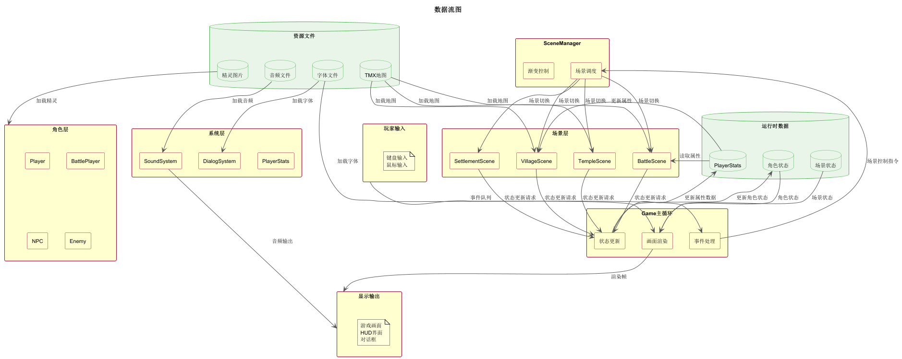
