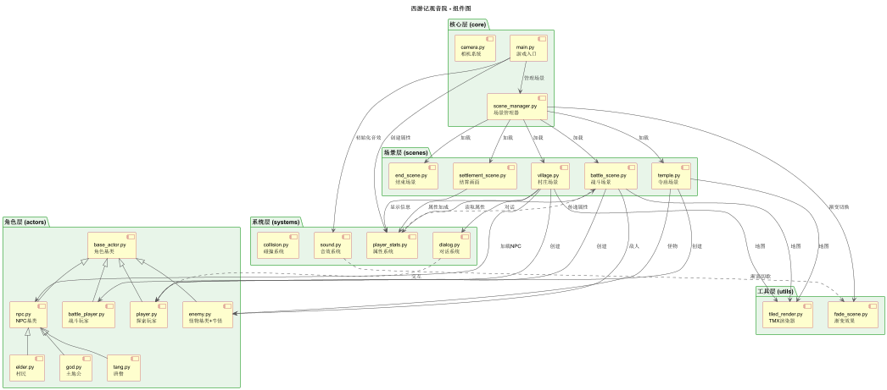
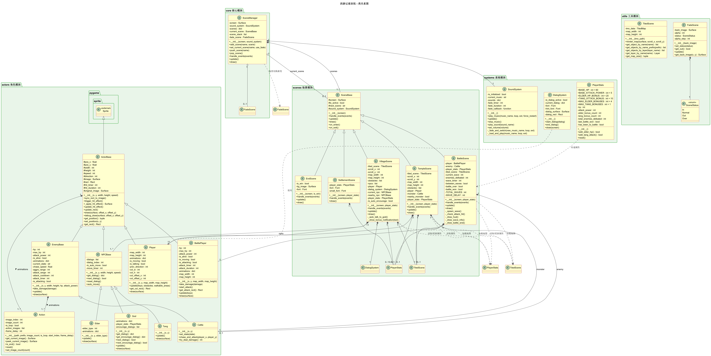
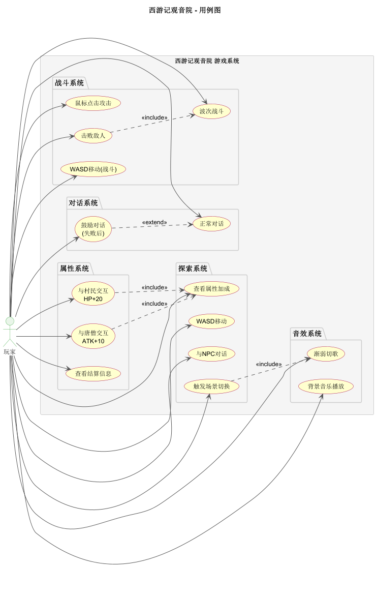
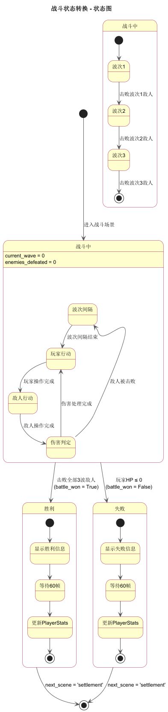
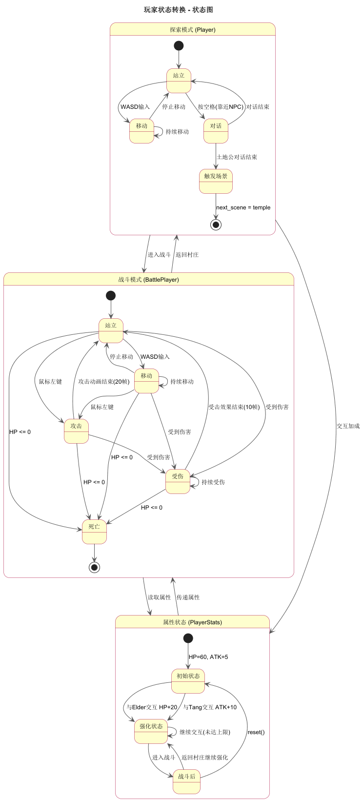
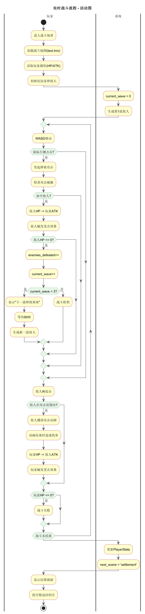
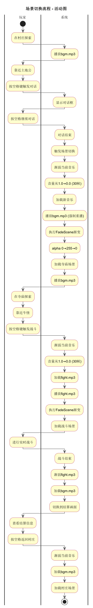
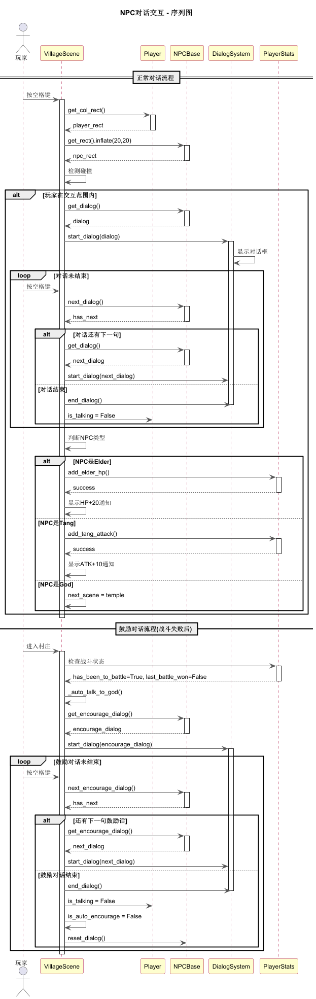
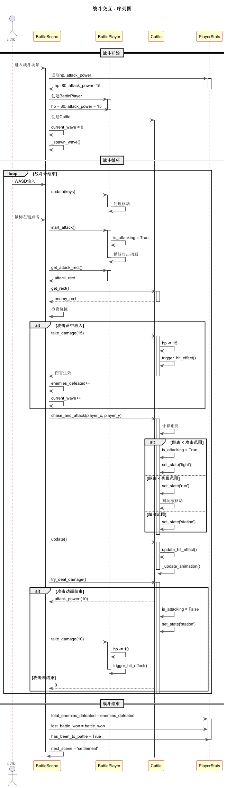

# 基于Pygame的2D西游记RPG小游戏

## 需求规格说明文档

**【课程名称】：** 软件项目开发与实践

**【项目名称】：** 基于Pygame的2D西游记RPG小游戏

**【编写日期】：** 2026年6月24日

**【编写人员】：** 5120240612 软件2401 李炜政

---

## 一、引言

### 1.1 编写目的

本文档是《基于Pygame的2D西游记RPG小游戏》的需求规格说明文档，旨在明确系统的功能需求、非功能需求和系统设计，为后续的开发、测试和维护提供依据。

本文档适用于以下读者：

- 项目开发人员：理解系统需求和设计
- 测试人员：编写测试用例
- 课程教师：了解项目需求和实现方案

### 1.2 项目背景

本项目为软件项目开发课程实训项目，以 Pygame 为开发框架，实现一款以西游记"祸起观音院"为故事背景的 2D RPG 游戏。玩家扮演孙悟空，需要在村庄中与NPC交互获取线索和属性加成，最终前往寺庙挑战牛怪。

### 1.3 定义与缩写

| 术语/缩写 | 说明 |
|-----------|------|
| RPG | Role-Playing Game，角色扮演游戏 |
| TMX | Tiled Map XML，Tiled地图编辑器格式 |
| HP | Hit Points，生命值/血量 |
| ATK | Attack，攻击力 |
| WASD | 游戏操控键位（上左下右） |
| HUD | Heads-Up Display，平视显示器（游戏界面信息） |
| FPS | Frames Per Second，每秒帧数 |
| Pygame | Python游戏开发库 |
| pytmx | Python TMX地图解析库 |

### 1.4 参考资料

- Pygame官方文档：https://www.pygame.org/docs/
- pytmx库文档：https://pytmx.readthedocs.io/
- Tiled Map Editor：https://www.mapeditor.org/
- 23步Pygame教程

## 二、项目概述

### 2.1 产品描述

《基于Pygame的2D西游记RPG小游戏》是一款2D RPG游戏，玩家扮演孙悟空在村庄和寺庙中探索，与NPC交互获取线索和属性加成，最终挑战牛怪找回袈裟。

### 2.2 产品功能

游戏包含以下核心功能：

1. **场景探索**：玩家可在村庄和寺庙场景中自由移动
2. **NPC交互**：与村民、土地公、唐僧对话，获取属性加成
3. **实时战斗**：WASD移动+鼠标点击攻击的实时战斗系统
4. **属性系统**：玩家属性（HP/ATK）可通过NPC交互提升
5. **波次战斗**：3波次战斗，击败敌人后出现下一波
6. **音乐系统**：场景切换时渐弱切歌
7. **结算系统**：战斗结束后显示结算信息

### 2.3 用户特征

| 用户类型 | 特征 | 需求 |
|---------|------|------|
| 游戏玩家 | 熟悉PC操作 | 流畅的游戏体验、清晰的操作提示 |
| 课程教师 | 了解Pygame开发 | 完整的功能实现、规范的代码结构 |
| 开发人员 | Python/Pygame开发 | 可扩展的架构、清晰的文档 |

### 2.4 运行环境

| 项目 | 要求 |
|------|------|
| 操作系统 | Windows 10/11 |
| Python版本 | Python 3.0及以上 |
| Pygame版本 | Pygame 2.0及以上 |
| pytmx版本 | pytmx 3.0及以上 |
| 分辨率 | 800×600像素 |
| 帧率 | 40 FPS |

### 2.5 约束条件

1. 必须使用Pygame框架开发
2. 必须使用pytmx库加载TMX地图
3. 必须使用面向对象编程思想
4. 必须实现角色基类支持扩展
5. 必须实现战斗系统（实时战斗）
6. 必须实现渐变效果
7. 必须实现音效系统（含渐弱切歌）
8. 使用提供的资源文件，不可外部引入

## 三、具体需求

### 3.1 功能需求

#### 3.1.1 场景显示模块

| 编号 | 功能名称 | 功能描述 | 优先级 |
|------|---------|---------|--------|
| F-001 | 背景图片显示 | 在窗口中显示游戏背景图片 | 高 |
| F-002 | TMX地图渲染 | 使用pytmx加载并渲染Tiled地图 | 高 |
| F-003 | 多图层支持 | 支持图块层、图像层、对象层 | 高 |
| F-004 | 地图封装 | 将TMX地图封装为可复用的TiledScene类 | 中 |

#### 3.1.2 角色系统模块

| 编号 | 功能名称 | 功能描述 | 优先级 |
|------|---------|---------|--------|
| F-010 | 精灵基类 | ActorBase继承pygame.sprite.Sprite，支持受击效果 | 高 |
| F-011 | 动画行为类 | Action类管理帧动画，支持循环/非循环、帧延迟 | 高 |
| F-012 | 玩家角色 | 孙悟空探索版（swk2素材，128帧PNG，4方向） | 高 |
| F-013 | NPC角色 | 村民(Elder)、土地公(God)、唐僧(Tang)实现 | 高 |
| F-014 | 怪物角色 | 牛怪(Cattle)实现，8种动画状态 | 高 |
| F-015 | 战斗玩家 | 孙悟空战斗版（swk素材，16帧TGA，WASD+鼠标攻击） | 高 |
| F-016 | 受击效果 | 角色被攻击时RGB通道变色（降低绿色和蓝色，偏红闪烁） | 中 |

#### 3.1.3 控制系统模块

| 编号 | 功能名称 | 功能描述 | 优先级 |
|------|---------|---------|--------|
| F-020 | 键盘控制 | 方向键/WASD控制玩家移动（探索和战斗均支持） | 高 |
| F-021 | 4方向动画 | 根据移动方向播放对应动画（下/左/上/右） | 高 |
| F-022 | TMX位置加载 | 从TMX对象层读取初始位置 | 高 |
| F-023 | 交互提示显示 | 靠近NPC/怪物时显示"按空格键发起对话/战斗"提示 | 高 |
| F-024 | 鼠标攻击 | 战斗中鼠标左键点击发起挥砍攻击 | 高 |
| F-025 | 攻击动画锁定 | 攻击动画期间玩家无法移动（风险/奖励机制） | 中 |

#### 3.1.4 碰撞系统模块

| 编号 | 功能名称 | 功能描述 | 优先级 |
|------|---------|---------|--------|
| F-030 | 矩形碰撞 | pygame.Rect碰撞检测 | 高 |
| F-031 | 障碍物碰撞 | 玩家与障碍物碰撞停步 | 高 |
| F-032 | NPC碰撞 | 玩家与NPC碰撞停步，防止重叠 | 高 |
| F-033 | NPC交互检测 | 玩家靠近NPC时inflate(20,20)扩大检测范围 | 高 |
| F-034 | 怪物碰撞 | 玩家与怪物碰撞停步 | 高 |
| F-035 | 怪物交互检测 | 玩家靠近怪物时inflate(40,40)扩大检测范围 | 高 |
| F-036 | 挥砍碰撞 | 战斗中鼠标攻击的挥砍范围碰撞检测 | 高 |
| F-037 | 脚部碰撞框 | 碰撞框设为素材50%宽×35%高，底部对齐 | 中 |

#### 3.1.5 场景管理模块

| 编号 | 功能名称 | 功能描述 | 优先级 |
|------|---------|---------|--------|
| F-040 | 相机系统 | 窗口跟随玩家移动（探索模式） | 高 |
| F-041 | 边界控制 | 避免玩家和窗口越界 | 高 |
| F-042 | 场景切换 | 村庄→寺庙→战斗→结算→村庄 完整流程 | 高 |
| F-043 | 渐变效果 | 场景切换渐入渐出效果 | 中 |
| F-044 | 结算场景 | 战斗胜利/失败后显示结算画面，按空格返回村庄 | 高 |

#### 3.1.6 对话系统模块

| 编号 | 功能名称 | 功能描述 | 优先级 |
|------|---------|---------|--------|
| F-050 | 对话框显示 | 显示半透明黑色对话框UI | 高 |
| F-051 | 文字绘制 | 第一行显示"角色名：对话内容"（24px粗体） | 高 |
| F-052 | 透明Surface | 对话框半透明效果 (alpha=200) | 中 |
| F-053 | 操作提示 | 第二行显示"按空格键继续·按Esc键退出"（14px粗体） | 高 |
| F-054 | 多行支持 | 对话内容自动换行显示 | 中 |
| F-055 | 鼓励对话 | 战斗失败后回村，土地公自动触发鼓励对话 | 高 |
| F-056 | 正常对话 | 玩家主动与土地公对话始终显示正常对话 | 高 |

#### 3.1.7 战斗系统模块

| 编号 | 功能名称 | 功能描述 | 优先级 |
|------|---------|---------|--------|
| F-060 | 实时战斗场景 | WASD移动+鼠标点击攻击的实时战斗 | 高 |
| F-061 | 敌人追击AI | 敌人自动追击玩家（仇恨范围300px，攻击范围40px） | 高 |
| F-062 | 敌人攻击 | 敌人攻击动画结束时造成伤害（攻击冷却60帧） | 高 |
| F-063 | 战斗玩家 | 战斗版孙悟空：WASD移动、挥砍攻击、4方向动画 | 高 |
| F-064 | 怪物动画 | 牛怪8种动画状态（station/walk/fight/die等） | 中 |
| F-065 | 战斗触发 | 在寺庙场景按空格键触发战斗（非自动触发） | 高 |
| F-066 | 战斗提示 | 靠近怪物时显示"按空格键发起战斗" | 高 |
| F-067 | 波次系统 | 多波次战斗（共3波），击败一只后出现下一只 | 高 |
| F-068 | 战斗HUD | 屏幕下方显示血条、攻击力、波次信息 | 高 |
| F-069 | 敌人血条 | 敌人头顶显示血条 | 中 |
| F-070 | 属性传递 | 玩家属性（HP/ATK）跨场景持久化 | 高 |

#### 3.1.8 属性系统模块

| 编号 | 功能名称 | 功能描述 | 优先级 |
|------|---------|---------|--------|
| F-080 | 玩家属性管理 | PlayerStats单例管理HP、攻击力等持久化属性 | 高 |
| F-081 | 初始属性 | HP=60, ATK=5（初始较弱，打不过敌人） | 高 |
| F-082 | 村民加成 | 与Elder交互 → HP+20（最多4次） | 高 |
| F-083 | 唐僧加成 | 与Tang交互 → ATK+10（最多1次） | 高 |
| F-084 | 加成通知 | 属性加成时屏幕中央显示通知（3秒） | 中 |
| F-085 | 属性上限 | 村民最多4次，唐僧最多1次，可配置 | 中 |

#### 3.1.9 音效系统模块

| 编号 | 功能名称 | 功能描述 | 优先级 |
|------|---------|---------|--------|
| F-090 | 背景音乐 | 各场景背景音乐循环播放 | 高 |
| F-091 | 音效播放 | 打斗、交互等音效 | 高 |
| F-092 | 场景音乐 | 不同场景不同背景音乐（village→bgm, temple→bgm, fight→fight） | 高 |
| F-093 | 渐弱切歌 | 切换场景时当前音乐渐弱到0，再加载新音乐 | 高 |
| F-094 | 强制重播 | 即使切换到同一首歌也重新播放 | 高 |

### 3.2 外部接口需求

#### 3.2.1 用户界面接口

| 界面元素 | 位置 | 说明 |
|---------|------|------|
| 游戏窗口 | 屏幕中央 | 800×600像素，标题"基于Pygame的2D西游记RPG小游戏" |
| HUD | 屏幕下方 | 血条、攻击力、波次信息（战斗中） |
| 对话框 | 屏幕底部 | 半透明黑色背景，双行文字 |
| 提示信息 | 角色头顶 | "按空格键发起对话/战斗" |
| 结算画面 | 屏幕中央 | 战斗结果、属性信息 |

#### 3.2.2 硬件接口

本游戏为纯软件应用，无需特殊硬件接口。支持标准键盘和鼠标输入。

### 3.3 非功能需求

| 需求编号 | 需求类型 | 需求描述 |
|---------|---------|---------|
| NF-001 | 性能需求 | 游戏运行帧率 ≥ 40 FPS |
| NF-002 | 性能需求 | 键盘操作响应延迟 < 50ms |
| NF-003 | 性能需求 | 游戏内存占用 < 500MB |
| NF-010 | 兼容性需求 | 支持Windows 10/11操作系统 |
| NF-011 | 兼容性需求 | 支持Python 3.0及以上版本 |
| NF-012 | 兼容性需求 | 支持Pygame 2.0及以上版本 |
| NF-020 | 可维护性 | 代码采用面向对象设计，支持扩展 |
| NF-021 | 可维护性 | 角色基类支持新角色继承扩展 |
| NF-022 | 可维护性 | 场景基类支持新场景扩展 |
| NF-023 | 可维护性 | 属性数值可配置（修改PlayerStats类常量） |

## 四、系统设计

### 4.1 系统架构

系统采用分层模块化设计，分为核心层、角色层、系统层、场景层和工具层。



各层职责如下：

- **核心层**：Game主类、场景管理器、相机系统，负责游戏初始化和主循环
- **角色层**：角色基类ActorBase、玩家Player/BattlePlayer、NPC基类NPCBase、怪物基类EnemyBase
- **系统层**：对话系统、属性系统、音效系统、碰撞系统
- **场景层**：场景基类SceneBase、村庄/寺庙/战斗/结算场景
- **工具层**：TMX渲染器、渐变效果

### 4.2 类设计

系统采用继承体系设计角色和场景类。



核心类说明：

| 类名 | 所属模块 | 职责 |
|------|---------|------|
| ActorBase | actors | 角色基类，管理位置、动画、受击效果 |
| Player | actors | 探索模式玩家，WASD移动 |
| BattlePlayer | actors | 战斗模式玩家，WASD+鼠标攻击 |
| NPCBase | actors | NPC基类，管理对话和自主移动 |
| EnemyBase | actors | 怪物基类，管理血量和追击AI |
| SceneBase | scenes | 场景基类，管理场景生命周期 |
| VillageScene | scenes | 村庄场景，含NPC交互和属性加成 |
| BattleScene | scenes | 战斗场景，实时战斗+波次系统 |
| PlayerStats | systems | 玩家属性管理，跨场景持久化 |
| SoundSystem | systems | 音效系统，含渐弱切歌 |

### 4.3 用例设计



玩家与系统的交互关系：

| 用例 | 触发条件 | 系统响应 |
|------|---------|---------|
| WASD移动 | 按WASD键 | 玩家角色移动 |
| 与NPC对话 | 靠近NPC按空格 | 显示对话框 |
| 触发场景切换 | 土地公对话结束 | 渐变切换到寺庙 |
| 鼠标点击攻击 | 鼠标左键点击 | 发起挥砍攻击 |
| 击败敌人 | 敌人HP≤0 | 敌人死亡，波次切换 |
| 与村民交互 | Elder对话结束 | HP+20 |
| 与唐僧交互 | Tang对话结束 | ATK+10 |
| 渐弱切歌 | 切换场景 | 当前音乐渐弱→新音乐播放 |

### 4.4 状态设计

#### 4.4.1 战斗状态



#### 4.4.2 玩家状态



### 4.5 流程设计

#### 4.5.1 实时战斗流程



#### 4.5.2 场景切换流程



#### 4.5.3 NPC对话交互



#### 4.5.4 战斗交互



## 五、数据设计

### 5.1 资源文件

| 类型 | 路径 | 说明 |
|------|------|------|
| 玩家精灵(探索) | resource/img/swk2/ | 孙悟空128帧PNG |
| 玩家精灵(战斗) | resource/img/swk/ | 孙悟空16帧TGA |
| NPC精灵 | resource/img/elder/ | 村民TGA格式 |
| 怪物精灵 | resource/img/cattle/ | 牛怪TGA格式 |
| 土地公 | resource/img/god/ | 土地公4方向40帧 |
| 地图文件 | resource/tmx/village1.tmx | 村庄地图 |
| 地图文件 | resource/tmx/temple.tmx | 寺庙地图 |
| 地图文件 | resource/tmx/test.tmx | 战斗地图（暂时） |
| 字体文件 | resource/font/newfont.TTF | 中文字体 |
| 背景音乐 | resource/sound/bgm.mp3 | 村庄/寺庙音乐 |
| 战斗音乐 | resource/sound/fight.mp3 | 战斗音乐 |

### 5.2 TMX地图结构

| 图层名称 | 类型 | 说明 |
|---------|------|------|
| backgroud | imagelayer | 背景图层 |
| actor | objectgroup | 玩家位置 (sun, tang) |
| elder | objectgroup | 村民NPC位置 (elder1~4) |
| god | objectgroup | 土地公位置 |
| child | objectgroup | 儿童NPC位置 |
| obstacle | objectgroup | 障碍物碰撞区域 |
| road | objectgroup | 可行走区域 |

### 5.3 玩家属性配置

| 属性 | 值 | 说明 |
|------|---|------|
| BASE_HP | 60 | 初始血量 |
| BASE_ATTACK_POWER | 5 | 初始攻击力 |
| ELDER_HP_BONUS | 20 | 每次与村民交互增加血量 |
| TANG_ATTACK_BONUS | 10 | 每次与唐僧交互增加攻击力 |
| MAX_ELDER_BONUSES | 4 | 最多4个村民可交互 |
| MAX_TANG_BONUSES | 1 | 1个唐僧可交互 |

### 5.4 战斗配置

| 属性 | 值 | 说明 |
|------|---|------|
| TOTAL_WAVES | 3 | 总波次数 |
| WAVE_DELAY | 90 | 波次间隔帧数（约2.25秒） |
| 敌人追击速度 | 1.5 | 比玩家慢（玩家速度4） |
| 敌人仇恨范围 | 300px | 开始追击的距离 |
| 敌人攻击范围 | 40px | 开始攻击的距离 |
| 敌人攻击冷却 | 60帧 | 攻击间隔（约1.5秒） |
| 挥砍范围 | 60px | 玩家攻击距离 |
| 挥砍宽度 | 80px | 玩家攻击宽度 |

## 六、附录

### 项目结构

```
journey_to_the_west/
├── main.py              # 游戏入口
├── config.py            # 全局配置
├── core/
│   ├── game.py          # Game主类
│   ├── camera.py        # 相机系统
│   └── scene_manager.py # 场景管理器
├── actors/
│   ├── action.py        # Action 动画行为类
│   ├── base_actor.py    # ActorBase 角色基类
│   ├── player.py        # Player 孙悟空(探索)
│   ├── battle_player.py # BattlePlayer 孙悟空(战斗)
│   ├── npc.py           # NPC基类
│   ├── elder.py         # Elder 村民
│   ├── god.py           # God 土地公
│   ├── tang.py          # Tang 唐僧
│   └── enemy.py         # EnemyBase + Cattle
├── systems/
│   ├── dialog.py        # 对话系统
│   ├── player_stats.py  # 玩家属性系统
│   ├── sound.py         # 音效系统
│   └── collision.py     # 碰撞系统
├── scenes/
│   ├── base_scene.py    # SceneBase 场景基类
│   ├── village.py       # 村庄场景
│   ├── temple.py        # 寺庙场景
│   ├── battle_scene.py  # 战斗场景
│   ├── settlement_scene.py # 结算画面
│   └── end_scene.py     # 结束场景
├── utils/
│   ├── tiled_render.py  # TMX渲染器
│   └── fade_scene.py    # 渐变效果
└── resource/            # 资源文件
```
